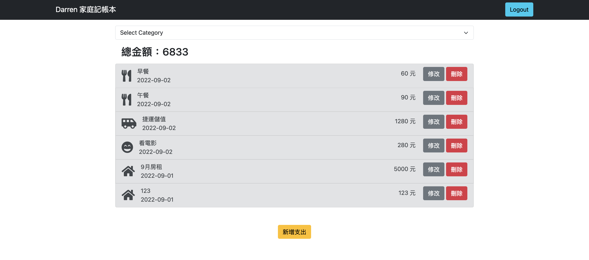

# Expense Tracker (我的記帳本)

這是一個使用 Node.js + Express 打造的記帳工具，可以將自己每天的花費記錄下來。

## Features
- 使用者可以註冊帳號或使用 Facebook Login 方式登入
- 使用者登入後，可以建立並管理專屬的支出清單
- 使用者可以瀏覽所有支出清單及總金額
- 使用者可以使用類別篩選支出項目
- 使用者可以新增支出
- 使用者可以編輯特定的支出資料
- 使用者可以刪除特定的支出資料

## Prerequisites
- Node.js 16.15.1
- Express 4.17.1
- Express-Handlebars 4.0.6
- Bootstrap 5.1.3
- mongoose 5.13.14
- MongoDB

## Installing
1. 打開終端機（terminal）並 Clone 專案至本機

```
$ git clone https://github.com/darrenjon/expense-tracker.git
```

2. 進入存放此專案的資料夾

```
$ cd expense-tracker
```

3. 安裝 npm 及專案所需套件(dependencies)

```
$ npm install
```

4. 依照.env.example 設定環境變數，並建立.env 檔

```
$ mkdir .env
```

5. 建立種子資料到資料庫中

```
$ npm run seed
```

6. 啟動伺服器

```
$ npm run dev
```

7. 當 terminal 出現以下字樣，表示伺服器已啟動完成

`The server is running on http://localhost:3000`
`mongodb connected!`

8. 打開瀏覽器網址列輸入 http://localhost:3000/
可以看到本專案的網頁呈現

9. SEED_USER 資料

email: user1@example.com
password: 12345678